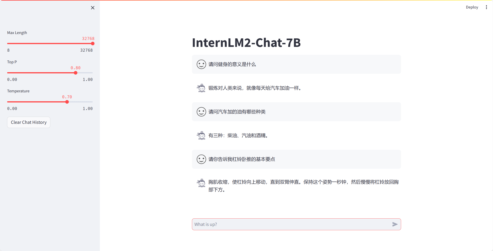

# InternLM-Workout-Assistant
# 书生·浦语 身体倍儿棒健身顾问
OpenXLab 体验地址：<https://openxlab.org.cn/apps/detail/Saige-Ring/InternLM-Workout-Assistant>

 生成)")

## 简介
在快节奏的现代生活中，保持健康的体魄和心态变得日益重要。我们尝试基于第一届“书生·浦语大模型实战营”大项目仓库，利用 InternLM/Xtuner/Langchain 等工具创建一位您的健身小助手，旨在通过高效、个性化的方法，为您的健康和健身之旅提供全方位支持。它不仅是一个工具，更是您的私人教练，营养顾问和健康管理伙伴。

- 大语言基座模型 - [InternLM2-7b-chat](https://github.com/InternLM/InternLM)
- 训练数据 - 健身相关中文书籍
- 词嵌入模型 - [bge-large-zh-1.5](https://huggingface.co/BAAI/bge-large-zh-v1.5)

整体训练思路：首先调用 LLM API 根据健身书籍内容生成对话数据，利用 Xtuner 微调 InternLM2-7b-chat；再利用词嵌入模型，构建向量数据库，用 Langchain 构建检索问答链；最后尝试在 OpenXLab 上部署。

## 数据
### 原始数据
-  《力量训练基础》 PDF
  专注于力量训练的基本原理和方法，包括正确的锻炼技巧、如何设置训练计划，以及各种力量训练器械的使用方法，涵盖如何避免受伤、如何根据个人目标（如增肌、减脂、增强核心力量等）调整训练计划，以及如何平衡不同肌群的训练等。
-  《无器械健身-用自重锻炼身体》 PDF
  专注于解答如何使用自身体重进行锻炼的各种方法，适合于没有健身器材或偏好在家锻炼的人。介绍了多种无器械锻炼动作，涵盖了从初级到高级的练习，解答关于无器械锻炼的常见疑问，如如何增加难度、如何确保动作效率和安全性等。
-  《别让不懂营养学的医生害了你》 TXT
  聚焦于营养学的基本原理，强调正确的饮食对健康和健身的重要性，辅助识别常见的营养误区，以及如何平衡宏观营养素、如何选择适合健身的食物，通过饮食达到特定的健康和健身目标。
-  1 和 2 为图片 PDF 版本，因此利用 [PaddleOCR](https://github.com/PaddlePaddle/PaddleOCR) 提取其中文字，保存成 TXT 文件。调用代码见 [pdf2txt.py](./pdf2txt.py)。

### 生成对话数据
利用智谱 GLM-4 API 根据健身书籍内容生成对话数据。调用代码见 [create_conversation.py](./create_conversation.py)。直接生成的数据格式不对，无法被正确读取，手动清洗数据至标准 JSON 格式。由于书籍 2&3 生成的问答数据效果不行，故下一步微调只选择了书籍 1 生成的问答数据，共计3k余条。

## 微调
-  使用 xtuner0.1.13 训练，在 internlm2-chat-7b 上进行微调
-  训练数据 《力量训练基础》对话版
-  参考配置 [internlm2_chat_7b_qlora_oasst1_e3.py](https://github.com/InternLM/xtuner/blob/main/xtuner/configs/internlm/internlm2_chat_7b/internlm2_chat_7b_qlora_oasst1_e3.py)，用生成的对话数据进行微调。
微调后模型对话表现：

## RAG

## OpenXLab 部署
仅需要 Fork 本仓库，然后在 OpenXLab 上创建一个新的项目，将 Fork 的仓库与新建的项目关联，即可在 OpenXLab 上部署 身体倍儿棒健身顾问。
OpenXLab 体验地址：<https://openxlab.org.cn/apps/detail/Saige-Ring/InternLM-Workout-Assistant>

## 参考
`requirements.txt` 参考自 [Law_InternLM](https://github.com/Aitejiu/Law_InternLM/blob/main/requirements.txt)
